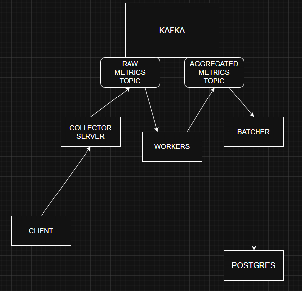

# load-metrics-collector


Представляет собой слой приёмки метрик для высоконагруженной телеметрии: принимет 
- collector принимает метрики по grpc stream'у кидает metric channel, отдельный цикл читает из канала, формирует сообщение и отправляет async producerом в Kafka:

```sh
metricCh: make(chan *pb.MetricRequest, 30000)
```
	Пример метрики:
```sh
{
  "service": "auth",
  "metric": "request_duration",
  "value": 42,
  "timestamp": 1700000000
}
```

- worker читает сообщения из Kafka формирует батч и записывает в batch channel, отдельный цикл читает канал и изменяет мапу Accumulator'ов, добавляет данные к бакету метрики, считая поля: Count, Sum (для среднего значения) Min, Max.

 Cледующий цикл обходит раз в кол-во времени мапу и проверяет прошла ли секунда с бакетов которые там, и записывает мапу с подходящими в snapshot channel. финальный цикл читает snapshot channel, формирует сообщение и отправляет в Kafka 
```sh
BatchCh: make(chan []*sarama.ConsumerMessage, 100),
```
```sh
AccMap:  map[AggrKey]*Accumulator{},

type AggrKey struct {
	Service string
	Metric  string
	Bucket  int64 // seconds
}

type Accumulator struct {
	Count int
	Sum   float32
	Min   float32
	Max   float32
	Avg   float32
	P95   float32
	Values []float32
}
```
```sh
SnapshotCh: make(chan map[AggrKey]*Accumulator, 20),
```

Ingestion pipeline (от сервиса который посылает метрики до агрегированной в Kafka) Под нагрузкой скриптом k6 сгенерированным ChatGPT:
- 1 worker instance 
- 1 collector instance
- Kafka: 8 partitions
- размер batch: 1000

результат:
- 10500 rps
- без потерь


docker-compose --profile tools run --rm protobuf_gen
